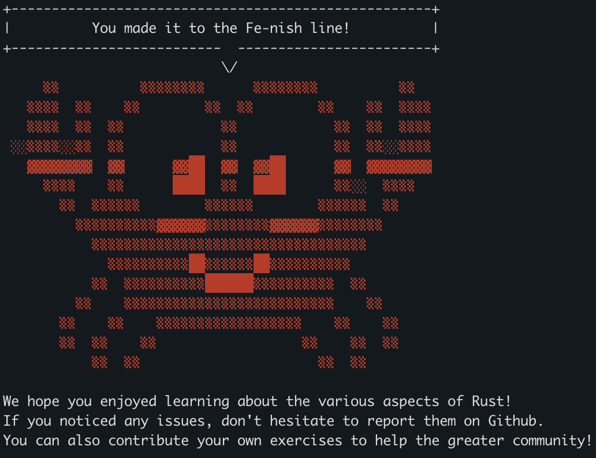
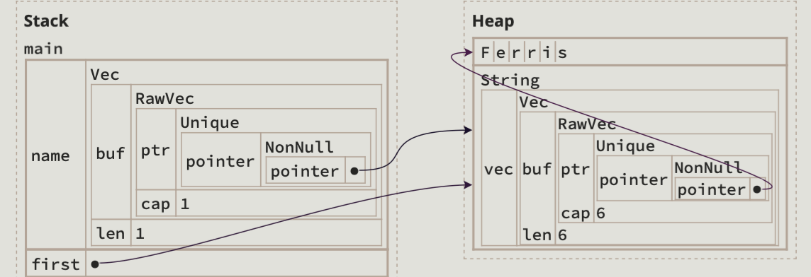

# Let's enjoy learing rust!



# Ownership

## <a href="https://rust-book.cs.brown.edu/ch04-03-fixing-ownership-errors.html#fixing-an-unsafe-program-not-enough-permissions">Case 1</a> - Aliase pointers can't be mut
```rust
fn stringify_name_with_title(name: &Vec<String>) -> String {
    name.push(String::from("Esq."));
    let full = name.join(" ");
    full
}
fn main() {
    let name = vec![String::from("Ferris")];
    let first = &name[0]; // img here
    stringify_name_with_title(&name);
    println!("{}", first);
}
```

- Remark: In this case, `name` is created, and `first` is created by following pointer `name`. `first` on the stack actually store the heap address of `name[0]`. However, when the function is called, the `.push()` may potentially cause `Vec` on the heap to reallocate. In this case, `first` will be a dangling pointer because the original `name[0]` address is undefined now. **When two pointers point to the same data, and you change the data through one pointer, another may become dangling.** The solution can be:
```rust
fn stringify_name_with_title(name: &Vec<String>) -> String {
    let mut name_clone = name.clone(); // solution: clone
    name_clone.push(String::from("Esq."));
    let full = name_clone.join(" ");
    full
}
```
However, `clone` can waste memory because it's a deep copy.


## <a href="https://rust-book.cs.brown.edu/ch04-03-fixing-ownership-errors.html#fixing-a-safe-program-mutating-different-tuple-fields">Case 2</a> - Safe but WON'T compile
```rust
// Compile version
let mut name = (
    String::from("Ferris"), 
    String::from("Rustacean")
);
let first = &name.0;
name.1.push_str(", Esq.");
println!("{first} {}", name.1);
```
```rust
// Not compile version
fn get_first(name: &(String, String)) -> &String {
    &name.0
}
fn main() {
    let mut name = (
        String::from("Ferris"), 
        String::from("Rustacean")
    );
    let first = get_first(&name);
    name.1.push_str(", Esq.");
    println!("{first} {}", name.1);
}
```
- Remark: In code 1, when we do `&name.0`, rust will only take the write permission of `name` and `name.0` to prevent dangling pointer. However, code 2 will not compile because when we do `get_first(&name)`, write permission of `name` and `name.0` and `name.1` will be taken. ***But, code 2 is safe***. Rust compiler just doesn't check implementation of `get_first()` when compiling `let first = get_first(&name)`. **Solution**: Can use `Cell` to deal with it or explicitly tell Rust the function takes which struct field.


## <a href="https://course.rs/basic/lifetime.html#深入思考生命周期标注">Case 3</a> - Return the ownership
```rust
// don't compile
fn longest<'a>(x: &str, y: &str) -> &'a str {
    let result = String::from("really long string");
    result.as_str()
}
```
```rust
// compile
fn longest<'a>(_x: &str, _y: &str) -> String {
    String::from("really long string")
}
```
- **Remark**: In the first code chunk, a poiter pointing to `result` is returned, but the `result` is owned by `longest`. Thus, `result` will be freed after function call and returned value will be a dangling pointer. In the second code chunk, the ownership is returned from `longest` func to outside variable. So `"really long string"` won't be freed after func call in second code. Also note that we want the function to take string slices, which are references, rather than strings, because we don’t want the `longest` function to take ownership of its parameters.


# Lifetime
## Case 1. Credit to <a href = "https://github.com/pretzelhammer/rust-blog/blob/master/posts/common-rust-lifetime-misconceptions.md#8-lifetimes-can-grow-and-shrink-at-run-time">this blog.</a>
```rust
struct Has<'lifetime> {
    lifetime: &'lifetime str,
}

fn main() {
    let long = String::from("long");
    let mut has = Has { lifetime: &long };
    assert_eq!(has.lifetime, "long");

    // this block will never run
    if false {
        let short = String::from("short");
        // "switch" to short lifetime
        has.lifetime = &short;
        assert_eq!(has.lifetime, "short");

        // "switch back" to long lifetime (but not really)
        has.lifetime = &long;
        assert_eq!(has.lifetime, "long");
        // `short` dropped here
    }

    assert_eq!(has.lifetime, "long"); // ❌ - `short` still "borrowed" after drop
}
```

- Remark: Borrow checker assumes every block in an if-else statement and every match arm in a match statement can be taken and then chooses the shortest possible lifetime for the variable. ***Once a variable is bounded by a lifetime it is bounded by that lifetime forever. The lifetime of a variable can only shrink, and all the shrinkage is determined at compile-time.*** In this case, even though the code chunk within `if` will never be executed, the borrow checker still updates lifetime according to code within it. In `if`, the lifetime of `has` shrinks permanently to short.


# Trait
## <a href="https://rust-book.cs.brown.edu/ch10-02-traits.html#specifying-multiple-trait-bounds-with-the--syntax">Case 1</a> - Idea behind trait syntax
```rust
// define function for types implemented with specific traits
fn some_function<T: Display + Clone, U: Clone + Debug>(t: &T, u: &U) -> i32 {}
// Display, Clone, Debug are three traits
```
```rust
// impl methods only on types with specific traits
struct Pair<T> {
    x: T,
    y: T,
}
impl<T> Pair<T> {
    fn new(x: T, y: T) -> Self {
        Self { x, y }
    }
}
impl<T: Display + PartialOrd> Pair<T> {
    fn cmp_display(&self) {
        if self.x >= self.y {
            println!("The largest member is x = {}", self.x);
        } else {
            println!("The largest member is y = {}", self.y);
        }
    }
}
// Display, PartialOrd are two traits
```
- Remark: **In my opinion**, trait resembles `ABC`(abstract base class) in python. `struct` + `impl` syntax resembles `__init__` + `def` in python. `ABC` is a behavior template. `struct` + `impl <trait_name> for <struct_name>` resembles `class <cls_name>(ABC)` in python. Flexibility is provided if we can take special care of types with specific behaviour(trait). The syntax above can do it.


